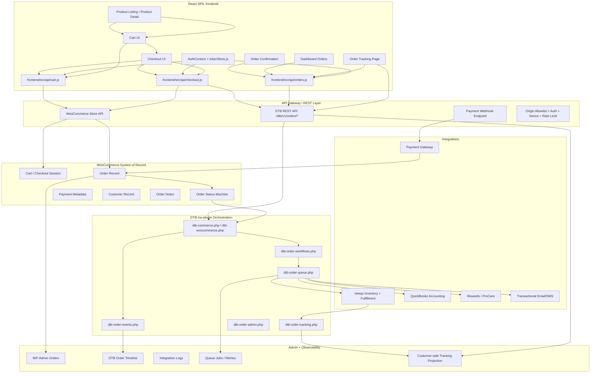

# Drywall Toolbox Product Ordering, Payment, Fulfillment & Tracking System

## Production-Grade Architecture & Workflow Map

## 1. Executive Overview

Drywall Toolbox’s product ordering infrastructure should be implemented as a first-class commerce workflow across the existing headless stack:

```text
React SPA
  -> DTB / WooCommerce API Gateway
  -> WooCommerce order/payment system of record
  -> DTB mu-plugin orchestration layer
  -> Payment gateway webhooks
  -> Veeqo inventory/fulfillment/shipping
  -> QuickBooks accounting
  -> Rewards/ProCare
  -> Customer-facing order tracking
  -> WP-Admin operator observability
```

This architecture must preserve the existing DTB boundaries:

```text
frontend/      = React storefront, cart, checkout, order tracking, account UI
wp/            = WordPress/WooCommerce backend and admin system
mu-plugins/    = DTB-specific business logic and integrations
WooCommerce    = product, cart, customer, order, payment-adjacent commerce record
Veeqo          = inventory, fulfillment, warehouse, shipping/tracking
QuickBooks     = accounting/invoice/revenue synchronization
Rewards        = customer loyalty and ProCare benefit logic
```

This aligns with the current repository model: React is the public frontend, WordPress/WooCommerce own backend commerce/admin responsibilities, and mu-plugins own custom application logic.  

WooCommerce is the correct commerce system of record for orders, customers, products, and transactional commerce data in this stack. WooCommerce’s REST API is designed to create, retrieve, and update commerce resources, including orders, through authenticated API access. ([WooCommerce][1])

---

# 2. Core Architecture Goals

The ordering system must provide:

```text
product browsing
cart management
checkout
payment authorization/capture
order creation
order confirmation
inventory reservation
fulfillment routing
shipment/tracking sync
customer order history
customer-facing order status tracking
operator observability
accounting synchronization
rewards issuance
refund/cancellation workflows
```

The system must avoid:

```text
placing payment logic directly in React
treating frontend cart state as authoritative
bypassing WooCommerce order records
writing direct SQL against orders where WooCommerce CRUD APIs are required
exposing raw payment, Veeqo, or QuickBooks failures to customers
duplicating order creation during retry/payment refresh flows
```

---

# 3. High-Level Architecture Map



---

# 4. Runtime Commerce Flow

## 4.1 Product Browse to Cart

```text
Customer browses products
  -> React product listing/detail routes
  -> frontend/src/api/products.js
  -> WooCommerce / DTB product APIs
  -> customer adds item to cart
  -> frontend/src/api/cart.js
  -> WooCommerce Store API cart/session
  -> cart totals, taxes, coupons, shipping options refresh
```

The cart displayed in React is a projection. WooCommerce remains authoritative for product pricing, taxability, cart totals, coupon validity, and checkout readiness.

---

## 4.2 Checkout and Order Creation

```text
Customer enters checkout
  -> React checkout form validates local fields
  -> server recalculates totals
  -> WooCommerce checkout creates pending order
  -> payment gateway receives payment intent/session
  -> customer completes payment
  -> gateway webhook confirms payment
  -> WooCommerce order transitions to processing/paid state
  -> DTB order workflow appends event
  -> fulfillment/accounting/rewards jobs enqueue
  -> frontend shows confirmation and tracking entry point
```

Payment confirmation should be webhook-driven, not based solely on the browser redirect. Stripe explicitly recommends idempotency keys to prevent duplicate PaymentIntent creation for the same purchase, and webhook endpoints must handle duplicate events because payment webhooks may be delivered more than once. ([Stripe Docs][2])

---

## 4.3 Fulfillment and Tracking

```text
Order paid / processing
  -> DTB workflow event appended
  -> Veeqo inventory reservation job queued
  -> fulfillment order created/synced
  -> warehouse/shipping status updates
  -> tracking number returned from Veeqo/carrier
  -> WooCommerce order meta/order note updated
  -> customer-safe tracking projection refreshed
  -> React order tracking page updates
```

---

## 4.4 Accounting and Rewards

```text
Order reaches eligible paid/fulfilled state
  -> QuickBooks sync job queued
  -> invoice/sales receipt generated or updated
  -> rewards eligibility calculated
  -> ProCare benefits applied where relevant
  -> reward issuance event logged
  -> customer dashboard reflects earned rewards
```

Rewards should not be issued solely on order creation. They should be issued when the order is paid and not cancelled/refunded beyond eligibility rules.

---

# 5. Domain Ownership

## 5.1 WooCommerce-Owned Data

WooCommerce owns:

```text
products
variations
prices
tax classes
cart totals
coupons
checkout session
customer record
order record
order line items
payment status
refund records
order notes
order status
```

WooCommerce HPOS introduces dedicated order tables and indexes to reduce order read/write overhead versus storing all order data in posts/postmeta, so DTB integration code should use WooCommerce CRUD APIs and remain HPOS-compatible. ([WooCommerce][3])

## 5.2 DTB-Owned Orchestration

DTB owns:

```text
order event ledger
customer-safe order tracking projection
integration queue orchestration
Veeqo sync state
QuickBooks sync state
Rewards/ProCare eligibility state
order observability UI
custom status mapping
deployment smoke tests
```

## 5.3 Frontend-Owned UI

React owns:

```text
cart drawer/page UI
checkout UI
payment handoff UI
order confirmation UI
order tracking UI
dashboard order history UI
recoverable error display
auth/session behavior
```

React must not own authoritative totals, payment success, inventory reservation, or fulfillment state.

---

# 6. Recommended Backend Module Layout

Add or formalize the ordering infrastructure as distinct mu-plugin modules:

```text
wp/wp-content/mu-plugins/
  dtb-commerce.php
  dtb-order-events.php
  dtb-order-workflows.php
  dtb-order-queue.php
  dtb-order-tracking.php
  dtb-order-admin.php
  dtb-payment-webhooks.php
```

## 6.1 Module Responsibilities

| Module                                     | Responsibility                                                  |
| ------------------------------------------ | --------------------------------------------------------------- |
| `dtb-commerce.php` / `dtb-woocommerce.php` | WooCommerce hooks, order metadata, checkout extensions          |
| `dtb-order-events.php`                     | Immutable order event ledger                                    |
| `dtb-order-workflows.php`                  | Order lifecycle mapping and transition orchestration            |
| `dtb-order-queue.php`                      | Async integration jobs and retries                              |
| `dtb-order-tracking.php`                   | Customer-safe tracking projection and tracking REST endpoints   |
| `dtb-order-admin.php`                      | WP-Admin columns, metaboxes, operator tools                     |
| `dtb-payment-webhooks.php`                 | Payment gateway webhook validation, idempotency, event handling |

---

# 7. Order Lifecycle State Model

WooCommerce remains the canonical order-status owner.

DTB should map WooCommerce statuses into a customer-safe order lifecycle projection.

## 7.1 WooCommerce Statuses

Typical WooCommerce lifecycle:

```text
pending
failed
on-hold
processing
completed
cancelled
refunded
```

## 7.2 DTB Customer-Safe Status Projection

| WooCommerce / Internal State | Customer Label        | Meaning                              |
| ---------------------------- | --------------------- | ------------------------------------ |
| `pending`                    | Order Received        | Order started, payment not confirmed |
| `on-hold`                    | Payment Under Review  | Awaiting confirmation/manual review  |
| `processing`                 | Processing            | Paid and preparing for fulfillment   |
| `dtb_inventory_reserved`     | Inventory Reserved    | Stock allocated                      |
| `dtb_picked`                 | Picking               | Warehouse picking order              |
| `dtb_packed`                 | Packed                | Shipment being prepared              |
| `dtb_shipped`                | Shipped               | Tracking available                   |
| `completed`                  | Delivered / Completed | Fulfillment complete                 |
| `failed`                     | Payment Failed        | Payment did not complete             |
| `cancelled`                  | Cancelled             | Order cancelled                      |
| `refunded`                   | Refunded              | Full or partial refund processed     |

DTB-specific fulfillment substates should not replace WooCommerce statuses. They should live in order meta and the event ledger.

---

# 8. Immutable Order Event Ledger

## 8.1 Table

```text
wp_dtb_order_events
```

## 8.2 Purpose

The event ledger provides:

```text
audit trail
customer timeline projection
operator timeline
integration retry correlation
payment webhook idempotency
fulfillment diagnostics
refund/cancellation history
analytics and SLA reporting
```

## 8.3 Schema

| Column            | Type                  | Notes                                                                   |
| ----------------- | --------------------- | ----------------------------------------------------------------------- |
| `id`              | bigint unsigned       | Primary key                                                             |
| `order_id`        | bigint unsigned       | WooCommerce order ID                                                    |
| `event_type`      | varchar(100)          | Example: `order.payment_confirmed`                                      |
| `from_status`     | varchar(50) nullable  | Previous status                                                         |
| `to_status`       | varchar(50) nullable  | New status                                                              |
| `actor_type`      | varchar(50)           | `customer`, `admin`, `system`, `payment_gateway`, `veeqo`, `quickbooks` |
| `actor_id`        | bigint nullable       | WP user/admin ID where available                                        |
| `source`          | varchar(100)          | `checkout`, `webhook`, `wp_admin`, `veeqo`, `cron`                      |
| `visibility`      | varchar(50)           | `customer`, `operator`, `internal`                                      |
| `idempotency_key` | varchar(191) nullable | Prevents duplicate handling                                             |
| `payload_json`    | longtext              | Sanitized structured payload                                            |
| `created_at`      | datetime              | UTC                                                                     |

## 8.4 Event Types

```text
order.created
order.payment_pending
order.payment_confirmed
order.payment_failed
order.payment_review_required
order.inventory_reserved
order.inventory_reservation_failed
order.fulfillment_queued
order.picked
order.packed
order.shipped
order.tracking_updated
order.delivered
order.completed
order.cancelled
order.refund_requested
order.refunded

integration.veeqo.queued
integration.veeqo.synced
integration.veeqo.failed
integration.quickbooks.queued
integration.quickbooks.synced
integration.quickbooks.failed
integration.rewards.queued
integration.rewards.issued
integration.rewards.failed

notification.order_confirmation.sent
notification.shipped.sent
notification.refund.sent
```

---

# 9. Checkout and Payment Architecture

## 9.1 Checkout Flow

```text
React Checkout UI
  -> validate customer fields locally
  -> server validates cart/session/totals
  -> WooCommerce checkout creates pending order
  -> payment gateway creates payment intent/session
  -> order stores payment intent/session reference
  -> customer confirms payment
  -> gateway webhook confirms outcome
  -> WooCommerce order state updates
  -> DTB workflow jobs enqueue
```

## 9.2 Payment Rules

The system must:

```text
use server-calculated totals only
store payment gateway IDs in order meta
use idempotency keys for payment/session creation
verify webhook signatures
handle duplicate webhooks
handle async payment success/failure
never trust frontend redirect alone
never expose raw payment errors publicly
```

## 9.3 Payment Event Handling

| Payment Event                  | Backend Action                                   |
| ------------------------------ | ------------------------------------------------ |
| Payment intent/session created | Store gateway reference                          |
| Payment succeeded              | Mark order paid/processing                       |
| Payment failed                 | Mark order failed or pending retry               |
| Async payment succeeded        | Confirm order and continue fulfillment           |
| Async payment failed           | Mark failed/on-hold and notify customer          |
| Charge refunded                | Update refund projection and rewards eligibility |

Stripe documents async payment success events such as `checkout.session.async_payment_succeeded` and completed checkout sessions, so the architecture must support asynchronous payment outcomes rather than assuming all payments finalize immediately. ([Stripe Docs][4])

---

# 10. Cart and Checkout Frontend

## 10.1 Files

```text
frontend/src/api/cart.js
frontend/src/api/checkout.js
frontend/src/api/orders.js
frontend/src/pages/Cart.jsx
frontend/src/pages/Checkout.jsx
frontend/src/pages/OrderConfirmation.jsx
frontend/src/pages/OrderTracking.jsx
frontend/src/components/cart/*
frontend/src/components/checkout/*
frontend/src/components/orders/*
frontend/src/hooks/useCart.js
frontend/src/hooks/useCheckout.js
frontend/src/hooks/useOrderStatus.js
```

## 10.2 Frontend Responsibilities

React should:

```text
render cart and checkout UX
collect customer/shipping/payment handoff details
call backend APIs
handle auth expiration
show recoverable checkout errors
display confirmation after verified backend order creation
render customer-safe order status
render customer-safe shipment tracking
```

React should not:

```text
calculate final authoritative totals
mark payment as successful
reserve inventory
create fulfillment shipments directly
issue rewards
sync QuickBooks
```

---

# 11. REST API / API Gateway

## 11.1 Namespaces

```text
WooCommerce Store API:
  /wp-json/wc/store/v1/*

DTB order APIs:
  /wp-json/dtb/v1/orders/*
```

The existing project already exposes and consumes custom API families including `dtb/v1`, WooCommerce Store API, and WooCommerce REST endpoints. 

## 11.2 DTB Endpoints

### Get Customer Orders

```http
GET /wp-json/dtb/v1/orders
```

Returns authenticated customer’s order summaries.

---

### Get Order Detail

```http
GET /wp-json/dtb/v1/orders/{order_id}
```

Returns customer-safe order detail for the authenticated owner or admin.

---

### Get Order Tracking

```http
GET /wp-json/dtb/v1/orders/{order_id}/tracking
```

Returns customer-safe tracking projection.

---

### Order Event Stream

```http
GET /wp-json/dtb/v1/orders/{order_id}/events/stream
```

Optional SSE endpoint for live order progress.

---

### Order Health

```http
GET /wp-json/dtb/v1/orders/health
```

Returns ordering subsystem health:

```json
{
  "ok": true,
  "woocommerce": true,
  "payments": true,
  "queue": true,
  "veeqo": true,
  "quickbooks": true,
  "events_table": true
}
```

---

# 12. Order Tracking Projection

## 12.1 Customer-Safe Projection

The customer tracking endpoint should return:

```json
{
  "order_id": 15024,
  "status": "shipped",
  "label": "Shipped",
  "placed_at": "2026-05-19T15:12:00Z",
  "last_updated_at": "2026-05-20T09:41:00Z",
  "tracking_number": "1Z999...",
  "carrier": "UPS",
  "tracking_url": "https://carrier.example/track/1Z999",
  "estimated_delivery": "2026-05-23",
  "items": [
    {
      "name": "TapeTech Finishing Box",
      "quantity": 1,
      "status": "shipped"
    }
  ],
  "timeline": [
    {
      "type": "order.created",
      "label": "Order placed",
      "occurred_at": "2026-05-19T15:12:00Z"
    },
    {
      "type": "order.payment_confirmed",
      "label": "Payment confirmed",
      "occurred_at": "2026-05-19T15:13:00Z"
    },
    {
      "type": "order.shipped",
      "label": "Order shipped",
      "occurred_at": "2026-05-20T09:41:00Z"
    }
  ]
}
```

## 12.2 Projection Rules

Customer projection may include:

```text
order placed
payment confirmed
processing
inventory allocated
packed
shipped
tracking number
carrier
estimated delivery
delivered/completed
refund/cancellation status
```

Customer projection must not include:

```text
raw payment gateway payloads
gateway decline internals
Veeqo API errors
QuickBooks sync failures
admin notes
fraud/risk scoring internals
queue job IDs
raw exception messages
```

---

# 13. Real-Time Order Tracking

## 13.1 Strategy

Use the same hybrid tracking model as repair services:

```text
Primary:
  GET /wp-json/dtb/v1/orders/{id}/tracking

Enhanced:
  GET /wp-json/dtb/v1/orders/{id}/events/stream

Fallback:
  polling every 15–30 seconds
```

Server-Sent Events are appropriate for customer order progress because the direction is primarily server-to-browser status updates. SSE uses the browser EventSource model for receiving server-pushed updates over HTTP. ([Stripe Docs][5])

## 13.2 SSE Payload

```text
event: order.status_changed
data: {"status":"shipped","label":"Shipped","occurred_at":"2026-05-20T09:41:00Z"}
```

## 13.3 Frontend Behavior

```text
initial page load fetches tracking snapshot
SSE subscribes when supported
polling fallback runs when SSE unavailable
material events trigger snapshot refresh
401 dispatches auth:expired
non-owner access returns safe authorization error
raw integration errors never render to customers
```

---

# 14. Fulfillment and Veeqo Integration

## 14.1 Veeqo Responsibilities

Veeqo should own:

```text
inventory reservation
warehouse allocation
fulfillment order sync
shipping label/tracking updates
shipment status updates
```

## 14.2 Fulfillment Flow

```text
WooCommerce order payment confirmed
  -> order.payment_confirmed event appended
  -> dtb_order_sync_veeqo job queued
  -> Veeqo order/fulfillment created or updated
  -> inventory reserved
  -> shipment/tracking returned
  -> order tracking projection refreshed
```

## 14.3 Failure Handling

| Failure              | Customer Behavior            | Operator Behavior               |
| -------------------- | ---------------------------- | ------------------------------- |
| Veeqo unavailable    | “Order is being prepared”    | Retryable sync failure          |
| Inventory conflict   | “Processing delay”           | Inventory exception queue       |
| Tracking unavailable | “Tracking pending”           | Shipment sync warning           |
| Fulfillment partial  | Per-item status if available | Partial fulfillment diagnostics |

---

# 15. QuickBooks Integration

## 15.1 Responsibilities

QuickBooks should own:

```text
sales receipt/invoice sync
customer accounting linkage
tax/revenue classification
refund accounting
payment reconciliation
```

## 15.2 Sync Triggers

| Order Event               | QuickBooks Action                       |
| ------------------------- | --------------------------------------- |
| `order.payment_confirmed` | Queue invoice/sales receipt             |
| `order.completed`         | Finalize accounting state               |
| `order.refunded`          | Create refund/credit memo               |
| `order.cancelled`         | Cancel/void pending accounting artifact |

QuickBooks failures must not block customer order tracking unless accounting failure also implies a payment/order integrity issue.

---

# 16. Rewards / ProCare

## 16.1 Eligibility

Rewards may be issued when:

```text
order is paid
order is not cancelled
order is not fully refunded
customer account exists
reward not already issued
line items are reward-eligible
ProCare rules applied
```

## 16.2 Reward Events

```text
integration.rewards.queued
integration.rewards.issued
integration.rewards.failed
```

## 16.3 Refund Handling

Refunds must trigger reward reversal or adjustment when business rules require it.

---

# 17. Notifications

## 17.1 Templates

```text
order-confirmation
payment-failed
order-processing
order-shipped
order-delivered
order-cancelled
order-refunded
partial-refund
backorder-delay
pickup-or-local-delivery-update
```

## 17.2 Rules

Notifications must be:

```text
event-driven
queue-backed
idempotent
template-based
logged to order events
safe for anonymous/guest orders
free of raw integration errors
```

---

# 18. Admin / Operator Observability

## 18.1 WP-Admin Order Enhancements

Add DTB operator panels to WooCommerce order admin:

```text
DTB Order Timeline
Payment Gateway State
Veeqo Fulfillment State
QuickBooks Sync State
Rewards State
Notification History
Queue Jobs / Retries
Customer Tracking Projection Preview
```

WooCommerce webhooks and webhook delivery logs are visible through WooCommerce status/log tooling, which supports debugging webhook delivery and integration behavior. ([WooCommerce][6])

## 18.2 List Columns

Add or formalize columns:

```text
Payment State
Fulfillment State
Tracking
Veeqo Sync
QuickBooks Sync
Rewards
Order Age
Exception Flag
Last DTB Event
```

## 18.3 Operator Actions

```text
Retry Veeqo Sync
Retry QuickBooks Sync
Refresh Tracking
Rebuild Tracking Projection
Resend Confirmation Email
Resend Shipping Email
Recalculate Rewards
Mark Fulfillment Exception
Clear Fulfillment Exception
```

All actions require nonce verification and appropriate capability checks.

---

# 19. Security Model

## 19.1 Checkout Security

Required controls:

```text
server-side cart total validation
server-side coupon validation
server-side tax/shipping recalculation
payment idempotency keys
webhook signature verification
rate limiting on checkout/payment endpoints
auth/ownership checks on order reads
safe public error messages
no client-trusted payment success
```

## 19.2 Order Access

| User Type              | Access                                  |
| ---------------------- | --------------------------------------- |
| Authenticated customer | Own orders only                         |
| Guest customer         | Order key/email/token-based lookup only |
| Admin/operator         | Capability-gated                        |
| Public anonymous user  | No raw order access                     |

## 19.3 Sensitive Data Never Exposed

```text
payment gateway payloads
payment method internals
fraud/risk metadata
raw webhook bodies
QuickBooks IDs unless admin
Veeqo raw payloads
admin notes
private customer metadata
```

---

# 20. Queueing and Retry Model

## 20.1 Queue Jobs

```text
dtb_order_sync_veeqo
dtb_order_sync_quickbooks
dtb_order_issue_rewards
dtb_order_send_notification
dtb_order_refresh_tracking_projection
dtb_order_reconcile_payment
dtb_order_handle_refund
dtb_order_archive_completed
```

## 20.2 Retry Policy

| Failure Type         | Retry | Notes                  |
| -------------------- | ----: | ---------------------- |
| Network timeout      |   yes | backoff                |
| Third-party 429      |   yes | exponential backoff    |
| Third-party 5xx      |   yes | retryable              |
| Validation failure   |    no | operator fix           |
| Auth/config failure  |    no | credential/config fix  |
| Duplicate webhook    |    no | mark already processed |
| Idempotency conflict |    no | return existing result |

---

# 21. Operational Data Alignment

The repo already uses `products/` and `scripts/` as real catalog/media/operations workspaces, not incidental files. 

## 21.1 Product/Order Validation

Checkout and fulfillment must validate:

```text
product exists
variation exists
SKU exists
price/tax/shipping recalculated server-side
stock/availability confirmed
shipping class present where required
hazmat/oversize rules applied if relevant
Veeqo SKU mapping exists
QuickBooks item mapping exists where required
```

## 21.2 Scripts

Add:

```text
scripts/smoke-dtb-orders.ps1
scripts/validate_order_integrations.py
scripts/audit_order_events.py
scripts/audit_order_tracking_projection.py
scripts/export_order_exception_report.py
scripts/validate_sku_veeqo_quickbooks_mapping.py
```

---

# 22. CI/CD Guardrails

Deployment pipeline should validate:

```text
WooCommerce Store API health
DTB orders health endpoint
checkout validation failure behavior
order tracking ownership behavior
guest tracking token/order-key behavior
payment webhook signature validation
queue availability
event table existence
Veeqo configuration presence
QuickBooks configuration presence
Rewards configuration presence
```

---

# 23. Frontend Performance Guardrails

Cart, checkout, confirmation, and order tracking must be isolated from product browsing performance.

Requirements:

```text
route-level code splitting
lazy-load checkout/payment components
avoid loading dashboard order history on initial storefront routes
keep cart payload minimal
avoid product media bloat in checkout bundle
skeleton UI for order tracking
mobile-first checkout UX
field-network resilience
graceful payment retry UX
```

---

# 24. End-to-End Ordering Workflow Pipeline

| Stage               | Trigger                     | Canonical Mutation               | Async Side Effects                    | Frontend Behavior            |
| ------------------- | --------------------------- | -------------------------------- | ------------------------------------- | ---------------------------- |
| Product Browse      | Customer views products     | None                             | Product/cache telemetry               | Product cards/details render |
| Add to Cart         | Customer adds item          | Woo cart/session updates         | Cart totals recalc                    | Cart UI updates              |
| Checkout Start      | Customer opens checkout     | Cart validated                   | Shipping/payment options loaded       | Checkout form renders        |
| Order Created       | Checkout submitted          | Woo pending order created        | Payment session/intent created        | Payment UI/handoff           |
| Payment Pending     | Customer authorizes payment | Gateway ref stored               | Await webhook                         | Processing/payment pending   |
| Payment Confirmed   | Webhook confirms            | Woo order paid/processing        | Veeqo, QB, rewards, notification jobs | Confirmation page            |
| Inventory Reserved  | Veeqo confirms              | Fulfillment projection updates   | Warehouse workflow                    | Tracker shows processing     |
| Packed/Shipped      | Veeqo/carrier updates       | Tracking meta/projection updates | Shipping notification                 | Tracker shows shipped        |
| Delivered/Completed | Carrier/admin confirms      | Woo completed/projection updates | Rewards finalization/accounting       | Tracker shows completed      |
| Refund/Cancel       | Customer/admin action       | Woo refund/cancel state          | QB/refund/reward reversal             | Tracker shows refund/cancel  |

---

# 25. Implementation Readiness Checklist

## Backend

```text
[ ] Formalize DTB order modules
[ ] Add wp_dtb_order_events table
[ ] Add order event append/query helpers
[ ] Add order workflow orchestration
[ ] Add payment webhook handler
[ ] Add idempotency handling
[ ] Add tracking projection builder
[ ] Add order tracking REST endpoint
[ ] Add optional SSE endpoint
[ ] Add order health endpoint
[ ] Add queue jobs
[ ] Add WP-Admin observability panels
```

## Frontend

```text
[ ] Harden cart API layer
[ ] Harden checkout API layer
[ ] Add OrderConfirmation page behavior
[ ] Add OrderTracking page
[ ] Add useOrderStatus hook
[ ] Add useOrderEventStream hook
[ ] Add dashboard order history/detail
[ ] Add checkout retry states
[ ] Add auth-expired handling
[ ] Add guest order lookup flow
```

## Integrations

```text
[ ] Payment gateway webhook verification
[ ] Veeqo order/fulfillment sync
[ ] Veeqo tracking sync
[ ] QuickBooks invoice/sales receipt sync
[ ] Rewards issuance/reversal
[ ] Notification templates
[ ] Retry/error logging
[ ] Admin retry tools
```

## Operations

```text
[ ] Add order smoke tests
[ ] Add webhook replay/idempotency tests
[ ] Add tracking projection audit
[ ] Add SKU mapping validation
[ ] Add failed integration report
[ ] Add runbook documentation
```

---

# 26. Recommended Build Sequence

## Phase 1 — Commerce Baseline Hardening

```text
cart API review
checkout API review
server-side total validation
order confirmation hardening
customer order history cleanup
```

## Phase 2 — Order Event Ledger

```text
wp_dtb_order_events table
event append/query helpers
WooCommerce status hook listeners
admin order timeline
customer-safe event visibility
```

## Phase 3 — Payment Reliability

```text
webhook validation
idempotency handling
duplicate webhook protection
payment status reconciliation
failure/retry UX
```

## Phase 4 — Fulfillment + Tracking

```text
Veeqo sync jobs
inventory reservation state
tracking projection
OrderTracking.jsx
SSE/polling fallback
shipping notification
```

## Phase 5 — Accounting + Rewards

```text
QuickBooks sync
invoice/sales receipt mapping
rewards issuance
refund reward reversal
operator diagnostics
```

## Phase 6 — Observability + CI

```text
admin panels
queue retry tools
health endpoint
smoke scripts
CI checks
runbook
```

---

# 27. Final Target Architecture

The final DTB ordering infrastructure should operate as:

```text
A WooCommerce-centered order/payment system of record,
orchestrated by DTB mu-plugins,
rendered through the React SPA,
integrated asynchronously with payment webhooks, Veeqo, QuickBooks, Rewards, and notifications,
and exposed to customers through a secure order tracking projection with operator-grade WP-Admin observability.
```

This is the correct production architecture because it:

```text
preserves the headless boundary
keeps WooCommerce authoritative for commerce data
keeps payment confirmation server/webhook-driven
prevents duplicate payments/orders through idempotency
supports HPOS-compatible order handling
makes fulfillment and accounting retryable
separates customer tracking from internal diagnostics
supports guest and authenticated order tracking
creates a full operational event ledger
scales without premature infrastructure overengineering
```
