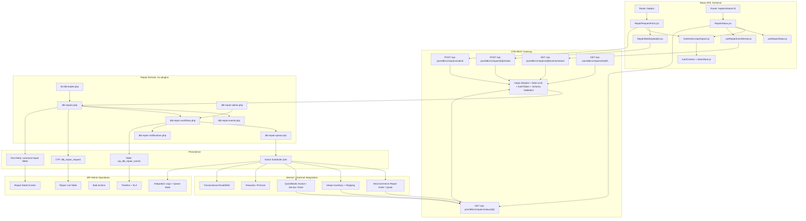

# Drywall Toolbox Repair Services System

## Production-Grade Architecture, Workflow, Tracking & Observability Specification

## 1. Executive Overview

Drywall Toolbox is a headless ecommerce and service platform for professional drywall contractors. The public application is a React SPA in `frontend/`, while WordPress and WooCommerce in `wp/` provide backend system-of-record responsibilities for products, customers, orders, media, and custom business workflows. 

The repair services system must be implemented as a first-class operational domain, not as a simple contact form, support ticket, or standard WooCommerce order extension. Repair services require intake, media upload, triage, quoting, approval, parts allocation, technician workflow, fulfillment, customer communication, accounting synchronization, rewards issuance, and repair-order progress tracking.

The production target is:

```text
React SPA
  -> DTB REST API
  -> Repair Domain mu-plugins
  -> Repair Event Ledger
  -> Async Job Queue
  -> WooCommerce / Veeqo / QuickBooks / Rewards / Notifications
  -> WP-Admin Operations Console
  -> Customer-facing real-time repair tracker
```

This design preserves the established DTB platform boundaries:

```text
frontend/      = customer-facing React application
wp/            = WordPress, WooCommerce, backend APIs, admin system
mu-plugins/    = custom backend business logic
products/      = catalog, image, and production data workspace
scripts/       = operational tooling and validation utilities
```

The existing repository already confirms that React is the public application layer, WordPress is the headless backend/API/admin layer, and custom business logic belongs in mu-plugins. 

---

# 2. Architecture Goals

## 2.1 Primary Goals

The repair architecture must:

1. preserve the headless React + WordPress/WooCommerce boundary;
2. keep repair business logic out of the frontend;
3. treat repair requests as lifecycle-managed domain records;
4. provide clean real-time or near-real-time repair progress tracking;
5. expose customer-safe tracking data through REST;
6. expose full operational observability inside WP-Admin;
7. synchronize asynchronously with WooCommerce, Veeqo, QuickBooks, Rewards, and Notifications;
8. provide immutable audit history;
9. support anonymous and authenticated customers;
10. remain deployable on the existing WordPress/WooCommerce stack.

## 2.2 Non-Goals

The repair system must not:

```text
use WordPress templates for public repair UI
put integration logic in React
treat repairs as plain WooCommerce orders only
expose raw sync errors to customers
depend on WebSockets for first production release
allow arbitrary post meta mutation as workflow state change
store customer-facing timeline data only in transient frontend state
```

---

# 3. Architectural Principles

## 3.1 Headless Boundary

The public repair experience is rendered by React. WordPress exposes APIs, admin tooling, media handling, commerce records, and workflow logic.

The browser-facing request path is:

```text
Browser
  -> React Router
  -> frontend/src/api/*
  -> WordPress REST API
  -> DTB mu-plugin domain logic
  -> WooCommerce / integrations / persistence
```

This aligns with the repository’s current runtime request flow. 

## 3.2 Backend Domain Ownership

Repair-domain ownership belongs in `wp/wp-content/mu-plugins/`.

The mu-plugin layer already serves as the backend composition mechanism for DTB modules such as auth, cache, REST APIs, rewards, membership, WooCommerce, Veeqo, and schematics. 

## 3.3 Canonical State Lives Server-Side

The frontend may render forms, progress UI, and optimistic loading states, but canonical repair progress must come from backend state.

Frontend state is not authoritative.

Canonical status is:

```text
_repair_status
```

Canonical audit history is:

```text
wp_dtb_repair_events
```

Customer-facing progress is a sanitized projection derived from backend state and events.

## 3.4 Event-Driven Workflow

Every repair transition must:

```text
validate current state
validate requested transition
validate actor capability
update canonical repair state
append immutable event
enqueue integration jobs
update customer-safe projection
notify relevant parties
expose updated status through REST
```

## 3.5 Async Integration by Default

Third-party side effects must not run synchronously inside the public repair submission request.

WooCommerce conversion, Veeqo reservation, QuickBooks sync, Rewards issuance, and notification dispatch should run through retryable background jobs. WooCommerce’s Action Scheduler is a practical fit for this WordPress/WooCommerce stack because it provides background processing for scheduled actions and operational visibility for queued jobs. ([WooCommerce][1])

---

# 4. High-Level Architecture Map



---

# 5. Runtime Request Flow

## 5.1 Repair Submission

```text
Contractor browser
  -> React route: /repairs
  -> RepairRequestForm.jsx
  -> frontend/src/api/repairs.js
  -> POST /wp-json/dtb/v1/repairs/submit
  -> DTB REST validation
  -> dtb-repairs.php
  -> repair CPT created
  -> repair meta saved
  -> repair.submitted event appended
  -> notification job queued
  -> admin queue receives repair
  -> customer receives confirmation
  -> frontend shows tracking link
```

## 5.2 Repair Status Tracking

```text
Customer opens /repairs/status/:id
  -> React loads RepairStatus.jsx
  -> frontend/src/api/repairs.js fetches snapshot
  -> GET /wp-json/dtb/v1/repairs/status/{id}
  -> backend validates owner or public tracking token
  -> backend returns sanitized repair projection
  -> React renders status tracker + timeline
  -> optional SSE stream subscribes to live events
  -> polling fallback keeps UI current
```

## 5.3 Admin Status Transition

```text
Operator opens repair in WP-Admin
  -> chooses valid transition
  -> nonce + capability validated
  -> dtb_transition_repair_status()
  -> canonical _repair_status updated
  -> event appended to wp_dtb_repair_events
  -> integration jobs queued
  -> customer-safe projection updates
  -> frontend tracker receives update by SSE or polling
```

---

# 6. Domain Model

## 6.1 Repair Aggregate

The repair record should be modeled as:

```text
Post Type:    dtb_repair_request
Post Status:  publish
State:        _repair_status
Events:       wp_dtb_repair_events
```

Do not use WordPress post statuses as the repair workflow state.

Use:

```text
post_status = publish
_repair_status = submitted | reviewed | approved | ...
```

Reason:

```text
WordPress post status should represent content lifecycle.
Repair workflow state should represent business lifecycle.
```

This avoids admin query pollution, post-status edge cases, and workflow confusion.

## 6.2 CPT

```text
dtb_repair_request
```

CPT responsibilities:

```text
repair identity
admin listing
basic ownership
searchability
media attachment linkage
meta-backed repair fields
```

## 6.3 Canonical Repair Status Enum

```text
submitted
reviewed
awaiting_customer
approved
quoted
quote_accepted
quote_declined
parts_allocated
in_progress
ready_to_ship
completed
closed
cancelled
```

## 6.4 Customer-Facing Labels

| Internal State      | Customer Label      |
| ------------------- | ------------------- |
| `submitted`         | Submitted           |
| `reviewed`          | Under Review        |
| `awaiting_customer` | Waiting on Customer |
| `approved`          | Approved            |
| `quoted`            | Quote Sent          |
| `quote_accepted`    | Quote Accepted      |
| `quote_declined`    | Quote Declined      |
| `parts_allocated`   | Parts Allocated     |
| `in_progress`       | Repair In Progress  |
| `ready_to_ship`     | Ready to Ship       |
| `completed`         | Completed           |
| `closed`            | Closed              |
| `cancelled`         | Cancelled           |

---

# 7. Meta Schema

## 7.1 Core Meta

| Meta Key                        |           Type | Required | Purpose                                |
| ------------------------------- | -------------: | -------: | -------------------------------------- |
| `_repair_status`                |           enum |      yes | Canonical workflow state               |
| `_repair_public_token`          |         string |      yes | Anonymous tracking token               |
| `_repair_idempotency_key`       |         string |      yes | Duplicate submission protection        |
| `_repair_customer_user_id`      |       int/null |       no | Linked WP/Woo user                     |
| `_repair_customer_email`        |          email |      yes | Primary contact                        |
| `_repair_customer_name`         |         string |      yes | Customer display name                  |
| `_repair_customer_phone`        |    string/null |       no | Optional phone/SMS                     |
| `_repair_tool_brand`            |         string |      yes | Brand alignment                        |
| `_repair_model`                 |    string/null |       no | Tool model                             |
| `_repair_serial`                |    string/null |       no | Serial number                          |
| `_repair_service_tier`          |      enum/null |       no | Standard, rush, rebuild                |
| `_repair_issue`                 | text/safe HTML |      yes | Customer issue                         |
| `_repair_images`                |          array |       no | Attachment IDs or sanitized media refs |
| `_repair_internal_notes`        |      safe HTML |       no | Admin-only notes                       |
| `_repair_assigned_tech_id`      |       int/null |       no | Technician assignment                  |
| `_repair_wc_order_id`           |       int/null |       no | WooCommerce linkage                    |
| `_repair_veeqo_sync_status`     |    string/null |       no | Veeqo status                           |
| `_repair_veeqo_tracking`        |    string/null |       no | Return tracking                        |
| `_repair_quickbooks_invoice_id` |    string/null |       no | Accounting linkage                     |
| `_repair_rewards_status`        |    string/null |       no | Reward issuance state                  |
| `_repair_submitted_at`          |       datetime |      yes | SLA tracking                           |
| `_repair_reviewed_at`           |  datetime/null |       no | SLA tracking                           |
| `_repair_completed_at`          |  datetime/null |       no | SLA tracking                           |
| `_repair_closed_at`             |  datetime/null |       no | Retention lifecycle                    |

## 7.2 Integration Projection Meta

Use integration projection meta for current operational state:

```text
_repair_integration_state
```

Suggested value shape:

```json
{
  "woocommerce": {
    "state": "synced",
    "order_id": 1204,
    "last_success_at": "2026-05-19T18:20:00Z",
    "last_error": null
  },
  "veeqo": {
    "state": "retrying",
    "tracking_number": null,
    "last_success_at": null,
    "last_error_code": "RATE_LIMITED"
  },
  "quickbooks": {
    "state": "pending",
    "invoice_id": null,
    "last_success_at": null,
    "last_error_code": null
  },
  "rewards": {
    "state": "not_eligible",
    "issued": false
  }
}
```

Raw error messages should be operator-visible only and never returned through public status endpoints.

---

# 8. Immutable Repair Event Ledger

## 8.1 Table

```text
wp_dtb_repair_events
```

## 8.2 Purpose

The event ledger provides:

```text
audit history
admin timeline
customer-safe timeline projection
integration diagnostics
retry correlation
SLA reporting
analytics
future replay/migration capability
```

## 8.3 Schema

| Column         | Type                 | Notes                                        |
| -------------- | -------------------- | -------------------------------------------- |
| `id`           | bigint unsigned      | Primary key                                  |
| `repair_id`    | bigint unsigned      | References repair CPT post ID                |
| `event_type`   | varchar(100)         | Example: `repair.submitted`                  |
| `from_status`  | varchar(50) nullable | Previous workflow state                      |
| `to_status`    | varchar(50) nullable | New workflow state                           |
| `actor_type`   | varchar(50)          | `system`, `customer`, `admin`, `integration` |
| `actor_id`     | bigint nullable      | WP user ID where available                   |
| `source`       | varchar(100)         | `rest`, `wp_admin`, `cron`, `veeqo`, etc.    |
| `visibility`   | varchar(50)          | `customer`, `operator`, `internal`           |
| `payload_json` | longtext             | JSON payload                                 |
| `created_at`   | datetime             | UTC timestamp                                |

## 8.4 Event Types

```text
repair.submitted
repair.media_uploaded
repair.reviewed
repair.info_requested
repair.approved
repair.quote_created
repair.quote_accepted
repair.quote_declined
repair.parts_allocated
repair.started
repair.ready_to_ship
repair.completed
repair.shipped
repair.closed
repair.cancelled

integration.woocommerce.queued
integration.woocommerce.created
integration.woocommerce.failed
integration.veeqo.queued
integration.veeqo.synced
integration.veeqo.failed
integration.quickbooks.queued
integration.quickbooks.synced
integration.quickbooks.failed
integration.rewards.queued
integration.rewards.issued
integration.rewards.failed

notification.email.queued
notification.email.sent
notification.email.failed
notification.sms.queued
notification.sms.sent
notification.sms.failed
```

## 8.5 Visibility Rules

| Visibility | Audience                | Example                      |
| ---------- | ----------------------- | ---------------------------- |
| `customer` | Customer status tracker | Repair Started               |
| `operator` | WP-Admin                | Veeqo retry scheduled        |
| `internal` | Debug/admin-only        | Raw exception correlation ID |

---

# 9. Workflow State Machine

## 9.1 Mandatory Transition Function

All workflow mutations must pass through:

```text
dtb_transition_repair_status($repair_id, $to_status, $context)
```

This function owns:

```text
current-state lookup
transition validation
capability validation
status update
timestamp update
event append
queue enqueue
notification enqueue
projection update
```

Forbidden:

```text
update_post_meta($repair_id, '_repair_status', ...)
```

from arbitrary modules.

## 9.2 Allowed Transitions

| From                | To                  | Actor          | Notes                              |
| ------------------- | ------------------- | -------------- | ---------------------------------- |
| `submitted`         | `reviewed`          | admin/system   | Initial triage                     |
| `submitted`         | `awaiting_customer` | admin          | Missing info/photos                |
| `reviewed`          | `approved`          | admin          | Repair accepted                    |
| `reviewed`          | `quoted`            | admin          | Quote needed                       |
| `awaiting_customer` | `reviewed`          | customer/admin | Required info received             |
| `quoted`            | `quote_accepted`    | customer/admin | Customer approves                  |
| `quoted`            | `quote_declined`    | customer/admin | Customer declines                  |
| `approved`          | `parts_allocated`   | system/admin   | Parts reserved                     |
| `quote_accepted`    | `parts_allocated`   | system/admin   | Quote accepted and parts allocated |
| `parts_allocated`   | `in_progress`       | admin/system   | Work started                       |
| `in_progress`       | `ready_to_ship`     | admin/system   | Repair done internally             |
| `ready_to_ship`     | `completed`         | admin/system   | Return shipment confirmed          |
| `completed`         | `closed`            | system/admin   | Archived/read-only                 |
| any active          | `cancelled`         | admin/system   | Cancelled workflow                 |

## 9.3 Terminal States

```text
closed
cancelled
quote_declined
```

Terminal states require explicit admin override for re-opening.

---

# 10. Frontend Architecture

## 10.1 Routes

| Route                    | Purpose                             |
| ------------------------ | ----------------------------------- |
| `/repairs`               | Repair intake                       |
| `/repairs/status/:id`    | Public/authenticated repair tracker |
| `/dashboard/repairs`     | Authenticated repair history        |
| `/dashboard/repairs/:id` | Authenticated repair detail         |

The existing application already includes `/repairs` as a user-facing repair intake surface. 

## 10.2 Files

```text
frontend/src/api/repairs.js
frontend/src/pages/Repairs.jsx
frontend/src/pages/RepairStatus.jsx
frontend/src/components/repairs/RepairRequestForm.jsx
frontend/src/components/repairs/RepairMediaUploader.jsx
frontend/src/components/repairs/RepairStatusTracker.jsx
frontend/src/components/repairs/RepairTimeline.jsx
frontend/src/components/repairs/RepairQuoteReview.jsx
frontend/src/components/repairs/RepairIntegrationNotice.jsx
frontend/src/hooks/useRepairStatus.js
frontend/src/hooks/useRepairEventStream.js
```

## 10.3 Repair Form Flow

```text
contact
  -> tool
  -> issue
  -> media
  -> shipping
  -> review
  -> submit
  -> confirmation
```

## 10.4 API Client Requirements

`frontend/src/api/repairs.js` must:

```text
use existing API client conventions
attach Bearer token when available
support anonymous repair submissions
include idempotency key on submit
normalize API errors
dispatch auth:expired on 401
never expose raw integration errors
support SSE fallback behavior
```

The project already has auth context, protected routes, in-memory token storage, and `auth:expired` handling for 401 flows. 

---

# 11. REST API Specification

WordPress REST routes should be registered with `register_rest_route()` and must include explicit permission callbacks, validation, and sanitization. The official WordPress documentation identifies `register_rest_route()` as the mechanism for registering custom REST routes and notes it should be used on the `rest_api_init` hook. ([WordPress Developer Resources][2])

## 11.1 Namespace

```text
/wp-json/dtb/v1
```

The existing backend already uses custom API namespaces, including `dtb/v1`, for application routes. 

## 11.2 Endpoints

### Submit Repair

```http
POST /wp-json/dtb/v1/repairs/submit
```

Purpose:

```text
Create a repair request.
```

Auth model:

```text
authenticated customer -> repair linked to user account
anonymous customer     -> repair linked to public tracking token
admin/operator         -> repair may be created on behalf of customer
```

Controls:

```text
origin allowlist
rate limit
idempotency key
schema validation
field sanitization
spam/honeypot guard
optional auth token parsing
customer-safe response
```

---

### Get Repair Status

```http
GET /wp-json/dtb/v1/repairs/status/{repair_id}
```

Access model:

```text
authenticated customer -> own repairs only
anonymous customer     -> valid public token required
admin/operator         -> dtb_manage_repairs capability
```

Returns:

```text
customer-safe repair status projection
```

Does not return:

```text
internal notes
queue internals
raw integration logs
admin identifiers
accounting details
raw exception messages
```

---

### Upload Repair Media

```http
POST /wp-json/dtb/v1/repairs/{repair_id}/media
```

Controls:

```text
file count limit
file size limit
MIME allowlist
extension/MIME consistency check
ownership/token validation
image normalization
metadata stripping
quarantine-before-attach model
```

---

### Event Stream

```http
GET /wp-json/dtb/v1/repairs/{repair_id}/events/stream
```

Purpose:

```text
Provide customer-safe live repair progress updates.
```

Transport:

```text
Server-Sent Events
```

SSE is appropriate because repair tracking is primarily server-to-client progress delivery. The browser-native `EventSource` API is designed to receive server-sent event streams over HTTP. ([MDN Web Docs][3])

---

### Health Check

```http
GET /wp-json/dtb/v1/repairs/health
```

Returns:

```json
{
  "ok": true,
  "rest": true,
  "queue": true,
  "events_table": true,
  "woocommerce": true,
  "veeqo_configured": true,
  "quickbooks_configured": true,
  "notifications": true
}
```

Used by deployment checks, smoke tests, and admin diagnostics.

---

# 12. Backend Module Layout

## 12.1 Loader

File:

```text
wp/wp-content/mu-plugins/00-dtb-loader.php
```

Recommended load order:

```text
dtb-utils.php
dtb-auth.php
dtb-cache.php
dtb-rest-api.php

dtb-repairs.php
dtb-repair-events.php
dtb-repair-workflows.php
dtb-repair-queue.php
dtb-repair-notifications.php
dtb-repair-admin.php

dtb-woocommerce.php
dtb-veeqo.php
dtb-quickbooks.php
dtb-rewards.php
```

## 12.2 Module Responsibilities

| Module                         | Responsibility                                 |
| ------------------------------ | ---------------------------------------------- |
| `dtb-repairs.php`              | CPT, REST routes, schema validation, core CRUD |
| `dtb-repair-events.php`        | Event table, append helpers, event queries     |
| `dtb-repair-workflows.php`     | State machine and transition rules             |
| `dtb-repair-queue.php`         | Background jobs, retries, idempotency          |
| `dtb-repair-notifications.php` | Email/SMS templates and dispatch               |
| `dtb-repair-admin.php`         | WP-Admin UI, columns, metaboxes, bulk actions  |
| `dtb-woocommerce.php`          | Repair quote/order generation                  |
| `dtb-veeqo.php`                | Parts reservation, inventory, shipping         |
| `dtb-quickbooks.php`           | Invoice/service-ticket sync                    |
| `dtb-rewards.php`              | Reward issuance and ProCare logic              |

---

# 13. WooCommerce Integration

## 13.1 Role

WooCommerce remains the commerce system of record for:

```text
repair service charges
repair quote/payment flows
parts line items
customer/order linkage
tax/shipping where applicable
```

The project already uses WooCommerce for catalog, customer, order, and cart-adjacent commerce capabilities. 

## 13.2 Order Strategy

Minimum viable production strategy:

```text
standard WooCommerce order
with explicit repair metadata
```

Recommended metadata:

| Meta Key                     | Purpose                    |
| ---------------------------- | -------------------------- |
| `_dtb_is_repair_order`       | Flags repair-related order |
| `_dtb_repair_id`             | Links order to repair CPT  |
| `_dtb_repair_service_tier`   | Service classification     |
| `_dtb_repair_quote_id`       | Quote linkage              |
| `_dtb_repair_parts_required` | Parts list                 |
| `_dtb_repair_status`         | Repair state projection    |

Future enhancement:

```text
custom repair order type or dedicated repair-order abstraction
```

## 13.3 WooCommerce Events

| Repair Event             | WooCommerce Action                             |
| ------------------------ | ---------------------------------------------- |
| `repair.approved`        | Create draft repair order or quote             |
| `repair.quote_accepted`  | Mark quote/order payable                       |
| `repair.parts_allocated` | Add service and parts line items               |
| `repair.completed`       | Complete linked order if eligible              |
| `repair.cancelled`       | Cancel linked repair quote/order if applicable |

---

# 14. Veeqo Integration

## 14.1 Role

Veeqo handles:

```text
parts availability checks
inventory reservation
fulfillment status
shipping label/tracking sync
warehouse/channel alignment
```

The existing backend already includes Veeqo-related integration responsibilities. 

## 14.2 Veeqo Events

| Repair Event               | Veeqo Job                       |
| -------------------------- | ------------------------------- |
| `repair.approved`          | Check required parts            |
| `repair.parts_allocated`   | Reserve parts inventory         |
| `repair.ready_to_ship`     | Create outbound return shipment |
| `integration.veeqo.synced` | Update tracking projection      |

## 14.3 Failure Behavior

Veeqo failures must not corrupt canonical repair state.

Pattern:

```text
repair state remains stable
Veeqo job marked retryable/failed
operator sees sync warning
customer sees neutral processing status
```

---

# 15. QuickBooks Integration

## 15.1 Role

QuickBooks handles:

```text
invoice draft/finalization
service ticket/accounting alignment
customer/account linkage
repair revenue classification
line-item accounting
```

## 15.2 QuickBooks Events

| Repair Event            | QuickBooks Job                          |
| ----------------------- | --------------------------------------- |
| `repair.quote_accepted` | Create estimate/invoice draft           |
| `repair.in_progress`    | Create service ticket if needed         |
| `repair.completed`      | Finalize invoice                        |
| `repair.cancelled`      | Void/cancel draft invoice if applicable |

## 15.3 Failure Behavior

QuickBooks failures should be operator-visible only.

Customer-facing tracking should not display accounting sync failure.

---

# 16. Rewards / ProCare Integration

Rewards and ProCare membership are real user-facing surfaces in the existing application. 

## 16.1 Eligibility Rules

Rewards may trigger only when:

```text
repair.status = completed
repair linked to a customer account
repair order paid or marked eligible
reward not previously issued
customer/account not excluded
```

## 16.2 Idempotency Meta

```text
_repair_rewards_issued
_repair_rewards_event_id
_repair_rewards_issued_at
```

## 16.3 Events

| Repair Event       | Rewards Action                   |
| ------------------ | -------------------------------- |
| `repair.completed` | Credit repair reward or discount |
| `repair.cancelled` | Prevent reward issuance          |
| `repair.closed`    | Archive eligibility state        |

---

# 17. Notification System

## 17.1 Channels

Initial channels:

```text
customer email
admin email
dashboard notification
optional SMS
```

## 17.2 Templates

```text
repair-submitted-customer
repair-submitted-admin
repair-info-requested
repair-reviewed
repair-approved
repair-quote-created
repair-quote-accepted
repair-in-progress
repair-ready-to-ship
repair-completed
repair-cancelled
```

## 17.3 Rules

Notifications must be:

```text
template-driven
queue-backed
idempotent
event-logged
retryable
localized where appropriate
safe for anonymous users
free of raw integration errors
```

## 17.4 Event Logging

Every notification attempt should append an event:

```text
notification.email.queued
notification.email.sent
notification.email.failed
notification.sms.queued
notification.sms.sent
notification.sms.failed
```

---

# 18. Security Model

## 18.1 API Security

Required controls:

```text
strict origin allowlist
rate limiting by IP and email
idempotency key enforcement
nonce or Bearer token where applicable
public tracking token for anonymous status
schema validation
field sanitization
permission_callback on every route
safe error responses
```

## 18.2 Sanitization Matrix

| Field        | Sanitization                      |
| ------------ | --------------------------------- |
| email        | `sanitize_email`                  |
| name         | `sanitize_text_field`             |
| phone        | normalized + sanitized string     |
| issue        | restricted text or `wp_kses_post` |
| URLs         | `esc_url_raw`                     |
| enum         | explicit allowlist                |
| IDs          | `absint`                          |
| JSON payload | strict schema validation          |

## 18.3 Media Security

Uploads must enforce:

```text
allowed MIME types
max file size
max file count
MIME/extension consistency
attachment ownership
image normalization
EXIF/metadata stripping
quarantine-before-final-attach
no trust in original filename
```

## 18.4 Public Tracking Privacy

Public status endpoint must never return:

```text
customer private data beyond necessary display
internal notes
admin user IDs
raw exception messages
integration payloads
QuickBooks/accounting identifiers
queue job IDs
security logs
```

---

# 19. Queueing & Retry Architecture

## 19.1 Queue Backend

Initial queue backend:

```text
Action Scheduler
```

Action Scheduler is suitable because it is a WordPress/WooCommerce-compatible background processing system designed for scheduled actions and async jobs. ([WooCommerce][1])

## 19.2 Job Types

```text
dtb_repair_create_wc_order
dtb_repair_sync_veeqo
dtb_repair_sync_quickbooks
dtb_repair_issue_rewards
dtb_repair_send_notification
dtb_repair_recalculate_sla
dtb_repair_archive_closed
dtb_repair_refresh_projection
```

## 19.3 Retry Policy

| Failure Type                   | Retry | Notes                   |
| ------------------------------ | ----: | ----------------------- |
| Network timeout                |   yes | backoff                 |
| 429/rate limit                 |   yes | exponential backoff     |
| Third-party 5xx                |   yes | retryable               |
| Third-party 4xx validation     |    no | requires operator fix   |
| Missing config                 |    no | admin alert             |
| Auth failure                   |    no | credential fix required |
| Duplicate idempotency conflict |    no | mark as already handled |

## 19.4 Job Idempotency

Every job must include:

```text
repair_id
event_id
job_type
idempotency_key
attempt_count
created_at
```

This prevents duplicate WooCommerce orders, duplicate invoices, duplicate rewards, and duplicate notifications.

---

# 20. Real-Time Repair Tracking & Observability

## 20.1 Objective

The repair system must provide clean frontend-to-backend progress tracking for every repair order without exposing backend implementation details to customers.

The model is:

```text
canonical backend state
  -> immutable event ledger
  -> customer-safe read projection
  -> React status tracker
  -> operator observability in WP-Admin
```

## 20.2 Canonical Tracking Flow

```text
Repair status transition
  -> dtb_transition_repair_status()
  -> update _repair_status
  -> append wp_dtb_repair_events row
  -> enqueue integration jobs
  -> update integration projection metadata
  -> expose sanitized status through REST
  -> push/fetch update in React tracker
```

The frontend must never infer repair progress locally. It renders backend-provided state.

## 20.3 Real-Time Delivery Strategy

Use a hybrid model:

```text
Primary snapshot:
  GET /wp-json/dtb/v1/repairs/status/{id}

Enhanced live updates:
  GET /wp-json/dtb/v1/repairs/{id}/events/stream

Fallback:
  polling every 15–30 seconds
```

SSE is the preferred first production real-time mechanism because repair tracking is one-way server-to-client progress delivery. WebSockets are not required unless DTB later adds bidirectional technician/customer messaging.

## 20.4 Status Snapshot Response

```json
{
  "repair_id": 1042,
  "status": "in_progress",
  "label": "Repair In Progress",
  "submitted_at": "2026-05-19T15:42:00Z",
  "last_updated_at": "2026-05-19T18:10:00Z",
  "estimated_completion": "2026-05-23",
  "tracking_number": null,
  "timeline": [
    {
      "type": "repair.submitted",
      "label": "Repair request submitted",
      "occurred_at": "2026-05-19T15:42:00Z"
    },
    {
      "type": "repair.reviewed",
      "label": "Repair request reviewed",
      "occurred_at": "2026-05-19T16:30:00Z"
    },
    {
      "type": "repair.started",
      "label": "Repair work started",
      "occurred_at": "2026-05-19T18:10:00Z"
    }
  ]
}
```

## 20.5 SSE Event Payload

```text
event: repair.status_changed
data: {"status":"in_progress","label":"Repair In Progress","occurred_at":"2026-05-19T18:10:00Z"}
```

Required headers:

```http
Content-Type: text/event-stream
Cache-Control: no-cache
```

SSE is an enhancement. Polling remains the guaranteed fallback.

## 20.6 Frontend Tracking Files

```text
frontend/src/api/repairs.js
frontend/src/hooks/useRepairStatus.js
frontend/src/hooks/useRepairEventStream.js
frontend/src/components/repairs/RepairStatusTracker.jsx
frontend/src/components/repairs/RepairTimeline.jsx
frontend/src/components/repairs/RepairIntegrationNotice.jsx
frontend/src/pages/RepairStatus.jsx
```

## 20.7 Frontend Tracking Behavior

```text
1. Load current repair snapshot.
2. Render canonical status and timeline.
3. Subscribe to SSE when supported.
4. Fall back to polling when stream unavailable.
5. Merge incoming customer-safe events into timeline.
6. Re-fetch canonical snapshot after material events.
7. Dispatch auth:expired on 401.
8. Show secure lookup prompt on invalid public token.
9. Never display raw integration failures to customers.
```

## 20.8 Customer Timeline

Customers may see:

```text
Submitted
Under Review
Waiting on Customer
Approved
Quote Sent
Quote Accepted
Parts Allocated
Repair In Progress
Ready to Ship
Shipped Back
Completed
Closed
Cancelled
```

Customers must not see:

```text
Veeqo API exception
QuickBooks retry count
Action Scheduler job ID
raw webhook payload
admin user ID
internal technician notes
sync stack trace
private accounting metadata
```

## 20.9 Operator Observability

WP-Admin must expose:

```text
canonical repair status
event timeline
assigned technician
SLA age
SLA breach state
linked WooCommerce order
Veeqo sync status
Veeqo tracking number
QuickBooks sync status
QuickBooks invoice/service ticket ID
rewards issuance state
notification delivery history
queue job state
retry count
last integration error summary
last successful sync timestamp
```

## 20.10 Internal Tracking Data Split

```text
_repair_status
  Canonical current workflow state

wp_dtb_repair_events
  Immutable timeline and audit ledger

Action Scheduler jobs
  Retryable async side effects

_repair_integration_state
  Current integration health projection

REST status projection
  Customer-safe read model

WP-Admin repair screen
  Full operator observability model
```

## 20.11 Projection Rules

Public/customer projection must:

```text
expose only safe timeline events
hide raw exception messages
hide internal notes
hide accounting metadata
hide queue internals
normalize technical delays into customer-safe copy
include last_updated_at
include tracking number only when shipment is customer-visible
include ETA only when operationally reliable
remain stable when integrations are retrying
```

Example:

```text
Internal:
  Veeqo sync failed, retry 2/5

Customer:
  Parts allocation is being processed.
```

## 20.12 Fallback Matrix

| Failure              | Customer Behavior          | Operator Behavior              |
| -------------------- | -------------------------- | ------------------------------ |
| SSE unavailable      | Polling fallback           | Log degraded real-time mode    |
| Queue delayed        | Stable current status      | Show pending job state         |
| Veeqo failure        | Neutral processing message | Retry/error details            |
| QuickBooks failure   | No customer-facing error   | Accounting sync warning        |
| Notification failure | No raw error               | Retryable notification failure |
| Invalid public token | Secure lookup error        | Failed access event            |

## 20.13 Acceptance Criteria

Tracking is production-ready when:

```text
every status mutation uses dtb_transition_repair_status()
every transition appends immutable event
React tracker renders from backend projection only
SSE works as enhancement
polling fallback works reliably
anonymous tracking requires valid public token
authenticated users see only their own repairs
admins see full diagnostics
customers never see raw integration failures
queue job state is visible in WP-Admin
failed integration jobs are retryable and auditable
timeline remains consistent after refresh
```

---

# 21. WP-Admin Operations Console

## 21.1 Repair List Table

Columns:

| Column        | Purpose                 |
| ------------- | ----------------------- |
| Repair ID     | Internal identifier     |
| Customer      | Name/email              |
| Brand         | Tool brand              |
| Model/Serial  | Tool identification     |
| Status        | Current workflow state  |
| Age           | Time since submitted    |
| SLA           | Normal/warning/breached |
| Woo Order     | Linked order            |
| Veeqo         | Sync state              |
| QuickBooks    | Sync state              |
| Assigned Tech | Internal owner          |
| Last Event    | Most recent event       |

## 21.2 Bulk Actions

```text
Mark Reviewed
Request Customer Info
Approve
Create Quote
Allocate Parts
Start Repair
Mark Ready to Ship
Mark Completed
Close
Cancel
Assign Technician
Retry Failed Integrations
```

All actions must:

```text
validate capability
verify nonce
use state machine
append event
enqueue side effects
refresh projection
```

## 21.3 Repair Detail Screen

Metaboxes:

```text
Customer Details
Tool Details
Issue Description
Media Gallery
Repair Timeline
Internal Notes
Quote / Order
Parts Allocation
Shipping / Tracking
Integration Logs
Queue Jobs
Notification History
Status Transition Controls
```

## 21.4 Capability

Recommended custom capability:

```text
dtb_manage_repairs
```

Avoid relying only on:

```text
manage_options
```

---

# 22. Observability

## 22.1 Log Channels

```text
repair.workflow
repair.api
repair.queue
repair.woocommerce
repair.veeqo
repair.quickbooks
repair.notifications
repair.security
repair.tracking
```

## 22.2 Metrics

| Metric                        | Purpose                   |
| ----------------------------- | ------------------------- |
| repair submissions/day        | Demand                    |
| average review time           | Triage SLA                |
| average completion time       | Operations                |
| quote acceptance rate         | Revenue                   |
| parts allocation failure rate | Inventory accuracy        |
| Veeqo sync failure rate       | Fulfillment health        |
| QuickBooks sync failure rate  | Accounting health         |
| notification failure rate     | Communication reliability |
| SSE disconnect rate           | Tracking quality          |
| polling fallback rate         | Tracking degradation      |

## 22.3 Admin Reports

```text
open repairs
aging repairs
SLA breach repairs
failed queue jobs
failed Veeqo syncs
failed QuickBooks syncs
unissued rewards
quote acceptance report
repair completion report
```

---

# 23. Operational Data Alignment

The repository includes `products/` and `scripts/` as major catalog, image, scraping, normalization, and maintenance workspaces. 

## 23.1 Catalog Alignment Rules

Repairable tool brands and parts must map against canonical product/catalog data.

Validation rules:

```text
repair brand exists in approved brand list
repair model maps to supported repair family when possible
repair parts exist in canonical catalog
repair service SKU exists before order creation
orphan repair parts fail CI validation
```

## 23.2 Scripts

Add:

```text
scripts/smoke-dtb-repairs.ps1
scripts/validate_repair_catalog_links.py
scripts/audit_repair_events.py
scripts/export_repair_sla_report.py
scripts/audit_repair_tracking_projection.py
```

## 23.3 CI/CD Validation

Deployment should validate:

```text
/dtb/v1/repairs/health
/dtb/v1/repairs/submit validation behavior
/dtb/v1/repairs/status/{id} token behavior
/dtb/v1/repairs/{id}/events/stream fallback behavior
origin allowlist behavior
queue availability
event table existence
repair module load order
```

---

# 24. Frontend Performance Guardrails

The `/repairs` and `/repairs/status/:id` routes must not degrade storefront performance.

Requirements:

```text
route-level code splitting
lazy-load media uploader
avoid bundling schematic/media data into repair route
client-side image preview optimization where practical
skeleton UI for tracker
mobile-first form behavior
resilient behavior on slow field networks
Lighthouse assertions for /repairs
Lighthouse assertions for /repairs/status/:id
```

The existing frontend stack uses React, React Router, Axios, Webpack 5, Babel, PostCSS/Tailwind, and route-level development/build tooling. 

---

# 25. End-to-End Workflow Pipeline

| Stage               | Trigger                         | Backend Mutation                                       | Async Side Effects                       | Frontend Behavior               |
| ------------------- | ------------------------------- | ------------------------------------------------------ | ---------------------------------------- | ------------------------------- |
| 1. Intake           | User submits repair form        | Create repair CPT; status `submitted`; append event    | Confirmation email; admin notification   | Success view + tracking link    |
| 2. Media Intake     | User uploads images             | Attach sanitized media; append `repair.media_uploaded` | Image normalization job                  | Shows uploaded images           |
| 3. Admin Triage     | Operator reviews request        | Status `reviewed` or `awaiting_customer`               | Customer info-request notification       | Tracker updates                 |
| 4. Approval / Quote | Admin approves or creates quote | Status `approved` or `quoted`                          | Woo quote/order job                      | Shows approved/quote state      |
| 5. Quote Response   | Customer accepts/declines       | Status `quote_accepted` or `quote_declined`            | Payment/order/accounting jobs            | Shows next step                 |
| 6. Parts Allocation | System/admin allocates parts    | Status `parts_allocated`                               | Veeqo reservation job                    | Shows parts allocated           |
| 7. Repair Work      | Technician starts repair        | Status `in_progress`                                   | QuickBooks service-ticket job            | Shows in progress               |
| 8. Ready to Ship    | Repair completed internally     | Status `ready_to_ship`                                 | Veeqo shipping label/tracking job        | Shows return shipping pending   |
| 9. Completion       | Shipment created/sent           | Status `completed`                                     | Woo complete, QB finalize, rewards issue | Shows completed + survey/reward |
| 10. Closure         | Retention/admin close           | Status `closed`                                        | Archive/retention job                    | Read-only history               |

---

# 26. Implementation Readiness Checklist

## 26.1 Backend

```text
[ ] Add dtb-repairs.php
[ ] Register dtb_repair_request CPT
[ ] Register repair meta schema
[ ] Add REST submit/status/media/health endpoints
[ ] Add SSE event stream endpoint
[ ] Add state machine transition function
[ ] Add immutable event table
[ ] Add event append/query helpers
[ ] Add queue integration
[ ] Add repair notification dispatcher
[ ] Add WP-Admin list columns
[ ] Add repair detail metaboxes
[ ] Add bulk status actions
[ ] Add capability dtb_manage_repairs
[ ] Add repair health endpoint
[ ] Add projection refresh logic
```

## 26.2 Frontend

```text
[ ] Add frontend/src/api/repairs.js
[ ] Refactor Repairs.jsx into route + components
[ ] Add RepairRequestForm.jsx
[ ] Add RepairMediaUploader.jsx
[ ] Add RepairStatus.jsx
[ ] Add RepairStatusTracker.jsx
[ ] Add RepairTimeline.jsx
[ ] Add RepairIntegrationNotice.jsx
[ ] Add useRepairStatus.js
[ ] Add useRepairEventStream.js
[ ] Add /repairs/status/:id
[ ] Add dashboard repair history
[ ] Add auth-expired handling
[ ] Add idempotency key support
[ ] Add polling fallback
```

## 26.3 Integrations

```text
[ ] Woo repair quote/order creation
[ ] Woo repair order metadata
[ ] Veeqo inventory reservation job
[ ] Veeqo tracking sync job
[ ] QuickBooks invoice/service-ticket job
[ ] Rewards issuance job
[ ] Email/SMS templates
[ ] Retry/error logging
[ ] Integration projection updates
```

## 26.4 Operations

```text
[ ] Add repair smoke tests
[ ] Add SLA reporting
[ ] Add failed job admin view
[ ] Add event audit script
[ ] Add tracking projection audit script
[ ] Add catalog repair SKU validation
[ ] Add deployment health checks
[ ] Add runbook documentation
```

---

# 27. Recommended Build Sequence

## Phase 1 — Core Repair Domain

```text
CPT
meta schema
REST submit/status endpoints
state machine
admin list table
basic email confirmation
```

## Phase 2 — Event Ledger + Timeline

```text
wp_dtb_repair_events table
event append helper
admin timeline metabox
public tracker timeline
status transition audit
```

## Phase 3 — Real-Time Tracking

```text
status projection endpoint
RepairStatus.jsx
RepairStatusTracker.jsx
SSE endpoint
polling fallback
public token access model
```

## Phase 4 — Async Queue

```text
Action Scheduler integration
job wrappers
retry policy
failed job visibility
health checks
```

## Phase 5 — WooCommerce Conversion

```text
repair quote/order creation
repair order metadata
repair service SKUs
payment/quote acceptance flow
```

## Phase 6 — Veeqo + QuickBooks

```text
parts reservation
tracking sync
invoice/service ticket sync
admin sync logs
retryable integration failures
```

## Phase 7 — Rewards + SLA + Reporting

```text
completion reward issuance
SLA metrics
aging dashboard
repair reports
archive/retention workflow
```

---

# 28. Final Target Architecture

The final repair system should operate as:

```text
A dedicated repair workflow engine inside DTB’s WordPress mu-plugin backend,
exposed through DTB REST APIs,
rendered through the React SPA,
tracked through a customer-safe real-time repair status projection,
operated through WP-Admin,
and synchronized asynchronously with WooCommerce, Veeqo, QuickBooks, Rewards, and notification systems.
```

The architecture is production-aligned because it:

```text
preserves the headless boundary
keeps business logic in mu-plugins
uses WooCommerce as commerce system of record
keeps Veeqo and QuickBooks async and retryable
adds immutable repair event history
supports real-time and fallback repair tracking
separates customer-safe progress from operator diagnostics
supports anonymous and authenticated users
keeps integrations observable without leaking internals
scales operationally without premature infrastructure overengineering
```

This is the complete production-grade architecture for DTB repair services: workflow-driven, event-backed, queue-aware, observable, and cleanly trackable from frontend to backend.